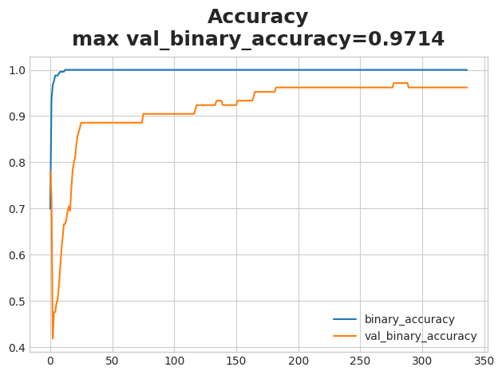

# Kaggle Learning
## An overview
With a bit of spare time on my hands, I felt the sudden urge to start my journey into some data science.
Hence began my journey through the Kaggle courses, namely:
- [Titanic Tutorial](https://www.kaggle.com/competitions/titanic)
- [Intro to Deep Learning](https://www.kaggle.com/learn/intro-to-deep-learning)

Hopefully, it'll be a fun experience, where I can learn the basics of a variety of models, but also improve my skills working with libraries such as NumPy, Pandas, etc.

This little quest will also be my first time working with Git, so that's exciting!

## An example of the process - Titanic
### The target
Given a dataset of specific information about passengers aboard the fateful Titanic incident, and if they survived or not - build a model to predict the survival of many other passengers given another unseen dataset.

### The data
In the [data](datasets/titanic/), the known factors of each passenger are:
- PassengerID
- Survived
- Passenger Class (Pclass)
- Name
- Sex
- Age
- Number of siblings and spouses aboard (SibSp)
- Parch
- Ticket
- Fare
- Cabin
- Embarked

### The model
The model used is a [RandomForestClassifier](https://scikit-learn.org/stable/modules/generated/sklearn.ensemble.RandomForestClassifier.html) part of the [scikit-learn](https://scikit-learn.org/stable/) library.

With the built in features of the RandomForestClassifier, it was relatively easy to fit the model against the [training data](datasets/titanic/train.csv), then predict the survival of each passenger in the [testing data](datasets/titanic/test.csv). 
This model has an approximate accuracy of 77%.

## Stuff I've learnt so far
### Venv
Better late than never.

### Git
A pretty awesome way to track my little quest. I learned how to:
- set up SSH key pairs to remotely access repositories
- push/pull
- checkout/merge branches (though not for this repository)

### tf.keras
Used the [Sequential](https://www.tensorflow.org/api_docs/python/tf/keras/Sequential) class in [red wine](notebooks/red_wine.ipynb) and [ionosphere](notebooks/ionosphere.ipynb).

Plotting the training history of a model was really interesting - it made a nice challenge to try and avoid under/overfitting. 
My approach was to tweak:
- Layer size
- Number of layers
- Dropout rates
- Early stopping patience

A highlight was when the [ionosphere](notebooks/ionosphere.ipynb) Sequential model managed a 94% accuracy on validation data. 
 
Maybe it got lucky, maybe it was pure skill on my end. Who knows?

I'm sure there's much more to just these parameters, and I look forward to learning more!

### Other

#### The side quest to get GPU support
I wanted to train my models locally, but found out that any TensorFlow version past 2.10 doesn't allow for native Windows GPU support. 
So I thought to myself, what is logical here? Hmm, maybe downgrade to TensorFlow 2.10?

Nah.

So, as any logical human being on Windows would do, I decided to migrate my quest over into WSL. There, I could happily have GPU support AND use latest TensorFlow version! Ez.
